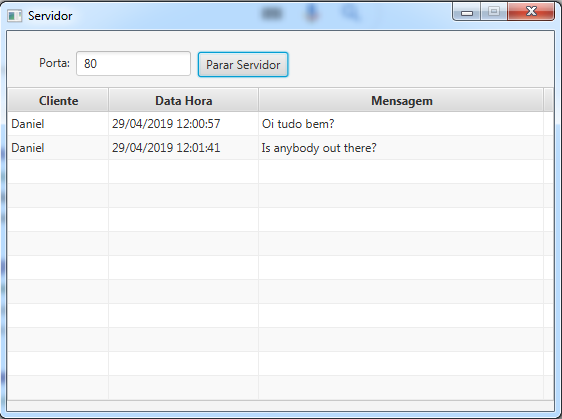
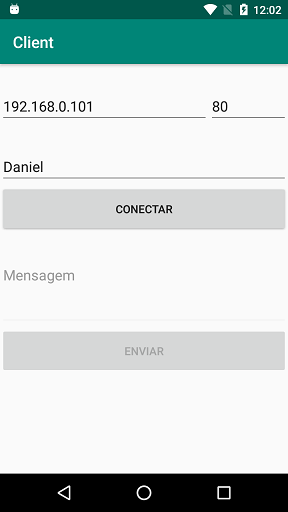

# Sockets

Desenvolver um sistema com um software cliente e um software servidor, que mostrará os clientes conectados e as mensagens enviadas por eles. O servidor deve permitir mais de uma conexão simultânea e identificar as mensagens por cliente.

O software servidor deve ser uma aplicação desktop (JavaFX) que aceite conexões Socket (TCP) em uma porta específica (configurável), ele deve ter a funcionalidade de iniciar ou parar o serviço a qualquer momento. O servidor também deve listar todos os clientes conectados (mostrar somente cliente online) e as mensagens enviadsa por eles, mostrando o horário em que a mensagem foi enviada.

O software cliente deve ser um aplicativo mobile (Android ou iOS) que tenha a opção de conectar em um ip e porta informados pelo usuário e enviar mensagens após a conexão ser estabelecida. 
As mensagens enviadas são textos digitados pelo usuário (deve-se dar um feedback para o usuário de que a mensagem foi recebida pelo servidor). 
O Aplicativo também deve dar a opção de se desconectar do servidor a qualquer momento.
O usuário deve informar um nome antes de se conectar, esse nome será utilizado pelo software servidor para identificar o usuário conectado.

